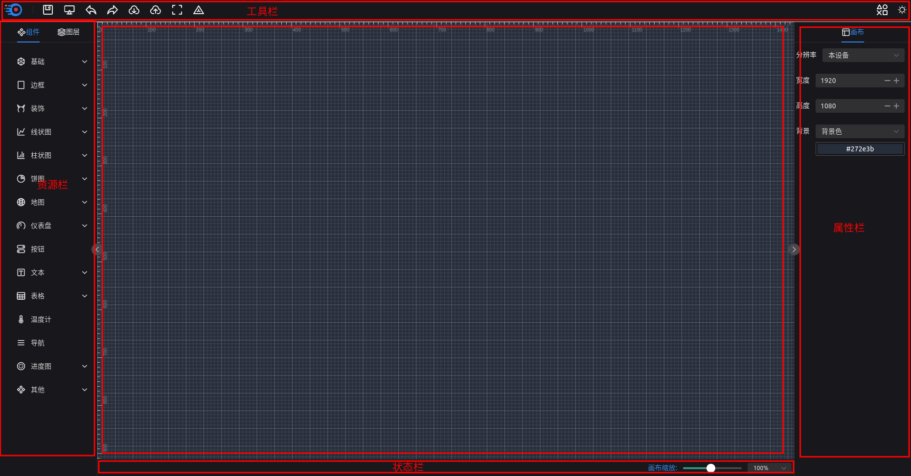

# 基础知识

## 入门须知

1. 本项目是基于`Vue3`开发，所有的组件都符合`Vue3`知识，对于`Vue3`知识不熟悉的同学建议，先学习`Vue3`相关知识

2. 本项目是采用`TypeScript`开发，若对于`TypeScript`知识欠缺的，可先熟悉一下`TypeScript`

3. 本项目中所有的组件只能在本项目中使用，无法保证在别的平台同样适用

# 编辑器

编辑器承载与渲染组件的容器，编辑提供了组件`拉伸`、`旋转`、`置顶`、`置底`、`组合`、`拆分`的能力，编辑器如下图：



编辑器主要由以下功能分区组成：

> - 顶部的`工具栏`：  常用工具按钮
> - 左侧的`资源栏`：  组件和图层
> - 右侧的`属性栏`：  属性分为组件属性和画布属性
> - 底部的`状态栏`：  创建页面的状态
> - 中间的`画布`：    承载组件的最顶层容器

# 组件

一个完整的组件又以下属性构成

```typescript
import manifest from './manifest.json'

export default {
  panel: () => import('./panel'),
  component: () => import('./StaticText.vue'),
  manifest
}

```

> - `manifest`：组件的元数据
> - `component`： 组件对象渲染模板
> - `panel`：组件的属性配置面板，建议异步加载

## 组件名

组件名必须保证全局唯一，因为组件会被挂载到`Vue3`实例对象上

## 组件元数据

组件元数据是一个`manifest.json`文件，在这里我们以静态文本为例

```json
{
  "name": "StaticText",
  "title": "静态文本",
  "category": "TEXT",
  "size": {
    "width": 150,
    "height": 20
  },
  "dataMode": "SELF"
}


```
各个属性含义

> - `name`: 组件名
> - `category`: 组件分类
> - `title`: 组件label
> - `size`: 组件初始化大小
> - `dataMode`: 数据接入方式，详见数据接入介绍

## 组件的配置面板

```typescript
import { FormType } from '@open-data-v/base'

export default {
  style: () => [
      {
          label: '字体设置',
          prop: 'font',
          children: [
              {
                  prop: 'color',
                  label: '颜色',
                  type: FormType.COLOR,
                  props: {
                      defaultValue: '#1E90FF'
                  }
              },
              {
                  prop: 'fontSize',
                  label: '字体大小',
                  type: FormType.NUMBER,
                  props: {
                      defaultValue: 20,
                      suffix: () => h('span', {}, 'px')
                  }
              },
              {
                  prop: 'fontWeight',
                  label: '字体宽度',
                  type: FormType.FONT_WEIGHT,
                  props: {
                      defaultValue: 200
                  }
              },
              {
                  prop: 'fontFamily',
                  label: '字体',
                  type: FormType.FONT_STYLE,
                  props: {
                      defaultValue: 'Arial'
                  }
              }
          ]
      }
  ],
  propValue: () => [
      {
          label: '基础配置',
          prop: 'base',
          children: [
              {
                  prop: 'type',
                  label: '文本类型',
                  type: FormType.SELECT,
                  props: {
                      defaultValue: 'text',
                      options: [
                          { value: 'text', label: '文本' },
                          { value: 'symbol', label: '符号' }
                      ]
                  }
              },
              {
                  prop: 'text',
                  label: '自定义文本',
                  type: FormType.TEXT,
                  props: {
                      defaultValue: 'OpenDataV'
                  }
              }
          ]
      }
  ], 
  demoLoader:() => []
}

```
各个属性含义

> - `style`: 组件的样式配置
> - `propValue`: 组件的属性配置
> - `demoLoader`: 组件的示例数据加载函数，可以是一个异步IO接口返回的数据，也可以是静态数据

部分组件自带示例数据，可以再组件初始化的时候展示示例数据


## 组件渲染模板对象

组件渲染模板对象是一个特殊的`Vue3`组件对象， 这个组件对象有一个`component`配置项对象,这里我展示Vue3 `setup script` 写法

```typescript

const props = defineProps<{
  component: CustomComponent
}>()

```

## 组件分类

目前组件分为 16类，分别是

- `BASIC`: 基础组件
- `BORDER`: 边框组件
- `DECORATION`: 装饰组件
- `LINE`: 线状图组件
- `BAR`: 柱状图组件
- `PIE`: 饼状图组件
- `MAP`: 地图组件
- `GAUGE`: 仪表盘组件
- `CUSTOM`: 自定义组件
- `TEXT`: 文本组件
- `TABLE`: 表格组件
- `NAVIFATION`: 导航组件
- `PROGERSS`: 进度条组件
- `THERMOMETER`: 温度计组件
- `OTHER`: 其他组件

用户按照组件特性选择对应的组件类型即可

## 组件属性

组件属性是定义了组件在编辑器右侧`属性栏`中的`属性`的可配置项

组件属性的由属性配置项对象`MetaContainerItem`和组件属性值对象构成


```typescript

  [
    {
      label: '基础配置',
      prop: 'base',
      children: [
        {
          prop: 'type',
          label: '文本类型',
          type: FormType.SELECT,
          props: {
            defaultValue: 'text',
            options: [
              { value: 'text', label: '文本' },
              { value: 'symbol', label: '符号' }
            ]
          }
        },
        {
          prop: 'text',
          label: '自定义文本',
          type: FormType.TEXT,
          props: {
            defaultValue: 'OpenDataV'
          }
        }
      ]
    }
  ]

```

该配置项对应的组件属性分别是

```typescript

StaticTextType {
  base: {
    text: string
    type: 'text' | 'symbol'
  }
}


```
属性配置项对象`MetaContainerItem`
- `label`: 分类标签
- `prop`: 分类值
- `children`: `AttrType`子属性配置项集合

`AttrType`子属性配置项

- `label`: 值标签
- `prop`: 属性值
- `type`: 属性值的Form类型
- `showLabel`: 是否显示标签
- `props`: Form组件配置
- `help`: Form帮助信息


## 组件样式

### 公共样式
所有的组件都有`位置大小`这个公共样式，公共样式主要是组件在画布中的`坐标`、`尺寸`和`旋转度`三个类属性

### 其他样式

其他样式组件属性的定义类似，只不过组件属性，需要你在组件中根据业务将属性值渲染出来，但是组件样式是里面的子属性值要求必须是CSS属性，本平台已经实现了常见的CSS样式渲染

## 组件可用Form类型

本平台已经实现了常用的Form类型，例如：

> - `TEXT`: Input框
> - `TEXTAREA`: 文本域
> - `NUMBER`: 数字输入框
> - `SELECT`: 选择器
> - `COLOR`: 色盘
> - `RADIO`: 单选框
> - `SWITCH`: 开关

以及平台定制的Form类型， 例如：

> - `FONT_STYLE`: 字体选择
> - `FONT_WEIGHT`: 字重选择
> - `ARRAY`: 动态列表Form
> - `BACKGROUND`: 背景选择
> - `LINEAR_GRADIENT`: 渐变色

还有支持用户自定义`Form`

> -`CUSTOM`: 自定义Form

**Form公共属性**

所有的Form 都有如下属性，其次每一种Form类型可能拥有自己独有的属性

|属性名|含义|说明|
|----|---|---|
|editable|是否可编辑| bool型|
|disabled|是否禁用| bool型|
|required|是否必须| bool型|
|defaultValue|默认值| 任意类型|
|options|自有配置项| 任意类型|

1. TEXT Form属性

无专有属性

2. NUMBER Form属性

|属性名|含义|说明|
|----|---|---|
|min|最小值| 数字型|
|max|最大值| 数字型|
|step|步长| 数字型|

3. SELECT Form属性

|属性名|含义|说明|
|----|---|---|
|options|选项列表| `Array<{value:any, label:string}>`|

4. SWITCH Form属性

|属性名|含义|说明|
|----|---|---|
|options|选项列表| `Array<{value:any, label:string}>`|

5. RADIO Form属性

|属性名|含义|说明|
|----|---|---|
|options|选项列表| `Array<{value:any, label:string}>`|

6. ARRAY Form 属性

|属性名|含义|说明|
|----|---|---|
|count|数量| 数字型|
|type|类型| `static`长度不可变，`dynamic`长度可变|
|maxItem|最大数量| 数字型|
|minItem|最小数量| 数字型|


7. CUSTOM Form 属性

|属性名|含义|说明|
|----|---|---|
|componentType|组件| Form组件|
|args|组件参数|任何类型|

8. 自定义Form类型

我们自定义Form类型，自定义Form组件需要实现属性`value`和`update:value`的`emit`方法,具体详见本平台`FONT_STYLE`或者`BACKGROUND`等平台定制Form组件


```typescript
const props = withDefaults(
  defineProps<{
    value?: number
  }>(),
  {
    value: 400
  }
)

const emits = defineEmits<{
  (e: 'update:value', weight: number): void
  (e: 'change', weight: number): void
}>()
```

## 监听组件属性

当用户通过`属性栏`的`属性`更改组件属性时，画布中的组件需要根据用户更改来，对组件进行重新渲染。

监听组件属性变化有三种方式

###  watch 观测

可以通过深度监听，监听组件 `component`属性对象的`propValue`属性或者子属性来监听组件属性更改

```typescript

const customeText = ref<string>(props.propValue.base.text)

watch( 
  () => props.propValue.base.text,
  (value: string) => {
    customeText.value = value
  }

)

```

### computed 计算属性

也可以通过computed计算组件 `component`属性对象的`propValue`属性或者子属性来监听组件属性更改

```typescript

const customeText = computed<string>(() => {
  return props.propValue.base.text
})

```

### hooks 

还可以通过平台提供的`useProp`hook来监听属性变化

```typescript
const customeText = ref<string>(props.propValue.base.text)
const propValueChange = (type:string, key:string, value:any) {
  if(type === 'base' && key === 'text'){
    customeText.value = value
  }
}
const { propValue } = useProp<StaticTextType>(props.component, propValueChange)

```

### 注意事项
需要注意的事，只有在编辑模式下才需要监听组件属性变化，在预览模式下不需要监听组件属性变化，因此可以在组件中判断编辑器模式(`什么是编辑器模式，详见编辑器模式`)，来决定是不是要对属性进行监听依次可以提升组件性能


## 数据

数据是通过`@open-data-v/data`插件包提供，插件包里面集成了以下数据接入能力

- **RestDataPlugin**: 支持从自定义Rest接口加载数据
- **StaticDataPlugin**: 支持通过页面UI输入静态数据
- **SubDataPlugin**: 支持通过发布定义功能获取其他组件的数据
- **WebsocketDataPlugin**: 支持通过Websocket接受实时数据

### 接入

```typescript

import { useDataState } from '@open-data-v/designer'
import {
  RestDataPlugin,
  StaticDataPlugin,
  SubDataPlugin,
  WebsocketDataPlugin
} from '@open-data-v/data'

const dataState = useDataState()

dataState.loadPlugins([
    RestDataPlugin,
    StaticDataPlugin,
    SubDataPlugin,
    WebsocketDataPlugin
])


```

组件元数据`manifest`z中在有一个`DataMode` 数据接入模式的属性，他定义了组件可以从那里接入数据

接入模式分为三类：

> - `SELF`: 组件自己内部自行接入数据
> - `UNIVERSAL`: 组件采用通用的方式接入数据
> - `GLOBAL`: 组件从订阅全局数据

### SELF 

组件自己在内部通过不管通过`HTTP`或者`WebSocket` 自己处理数据的请求和响应,这时候组件的`属性栏`没有`数据`配置项

```typescript

const activeCount = ref<string>(props.propValue.base.count)

const getData = async () => {
  const resp = await http.get({url: '/getdata'})
  activeCount.value = resp.data
}
const intervalId:number = 0
onMounted( () => {
  clearInterval(intervalId)
  intervalId = setInterval( getData, 30000)
})

onUnmounted( () => {
  clearInterval(intervalId)
})


```


### UNIVERSAL

组件采用`useData`hook来统一处理数据，通用数据处理方式目前提供了三种数据接入方式，分别是`示例数据`、`静态数据`、`Rest数据`

> - `示例数据`: 示例数据无法更改，主要 用来组件的展示，不建议在生产环境下使用
> - `静态数据`: 静态数据从后台数据库中存储的静态数据中加载
> - `Rest数据`: 根据用户提供的`REST`接口，发起HTTP请求，获取数据
> - `Websocket数据`: 通过Websocket方式获取数据
> - `Sub数据`: 通过EventBus消息总线订阅数据


```typescript

import { useData } from 'open-data-v/base/hooks'
let chartData:
  | Array<{ label: string; value: number }>
  | RequestResponse<Array<{ label: string; value: number }>>['afterData'] = []
const dataChange = (resp: any, _: DataType) => {
  if (resp.status >= 0) {
    chartData = resp.afterData
    doSomething(chartData)
  }
}

useData(props.component, dataChange)

```

`useData`钩子的第二个参数是一个数据处理回调，入参是获取到的数据，用户可以在回调中根据数据处理组件的渲染

### GLOBAL

组件的数据加载不是通过组件自身实现的，是通过画布统一加载再分发给各个组件,全局数据插件获取到数据之后通过发布订阅讲数据发布出于，组件通过数据订阅插件，进行订阅消费

哪些数据组件可以被应用再全局，取决于插件本身的`useTo`, 例如Rest 数据插件可用于`COMPONENT 组件`和`GLOBAL全局`


```typescript
export default {
    type: 'REST',
    name: '动态数据',
    component: shallowRef(RestPane),
    handler: RestHandler,
    useTo: ['COMPONENT', 'GLOBAL'],
    getDefaultOption: () => {
        return {
            method: RequestMethod.GET,
            url: '/getRiskArea',
            headers: [{ key: '', value: '', disable: false, id: uuid() }],
            params: [{ key: '', value: '', disable: false, id: uuid() }],
            data: [{ key: '', value: '', disable: false, id: uuid() }],
            otherConfig: {
                isRepeat: false,
                interval: 1000
            }
        }
    }
}
```


# 监听组件尺寸

不管是在`画布`中`拉伸`组件还是通过`属性栏`的`样式`里面的`位置大小`属性进行配置，都会引起组件大小变动，可以通过`v-resize`指令来监听组件大小的更改，具体详见`常见指令`章节


# 编辑器模式

1. 模式分类

编辑器分为`编辑模式(EDIT)`、`预览模式(PREVIEW)`、`视图模式(VIEW)`


2. 模式作用

在组件中可以根据编辑器的模式来切换不同的表现形式，例如：

> 
> - 在`编辑模式`下我们需要监听组件属性或者样式的变化，但是在`预览模式`和`视图模式`下我们不需要监听组件属性的变化,这时候我们可以获取编辑器模式，来在不同模式下采用不同的逻辑。

> 
> - 在`编辑模式`下我们采用示例数据来渲染组件，但是在`预览模式`和`视图模式`下我们采用生产数据渲染组件。


3. 获取组件模式

我们可以通过`canvasState`来获取编辑器模式,例如

```typescript
import useCanvasState from  'open-data-v/designer/state/canvas'

const canvasState = useCanvasState()
// editoMode 即为编辑器模式
canvasState.editMode

// isEditMode 可以判断编辑器是否处于编辑模式
canvasState.isEditMode

```

# 常用指令

`v-resize` 组件缩放

组件编辑器中经常需要被拉伸进行放大或者缩小，可以采用我们封装的`v-resize`指令,来监听组件的大小变化，以便做出对应的响应

```html
<div v-size="resizeHander">我是组件</div>
```

```TypeScript
const resizeHandler = (entry: ResizeObserverEntry) => {
  const {width, height}: DOMRectReadOnly = entry.contentRect
  doSomething()
}
```


